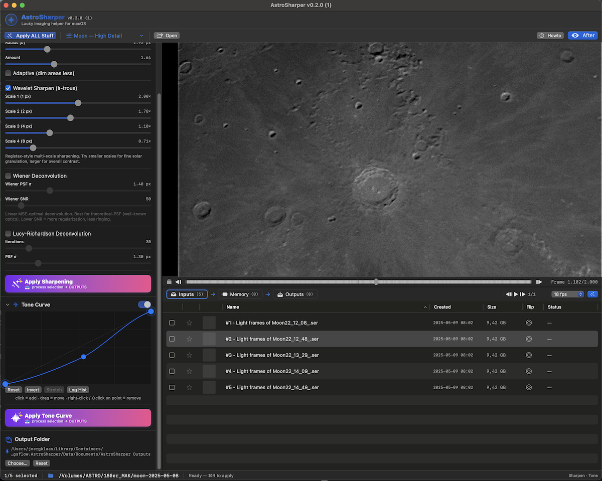

# AstroSharper

### Lucky imaging helper for macOS

A native, GPU-accelerated lucky-imaging companion for solar, lunar and planetary astrophotographers — built from the ground up in **Swift + Metal** for Apple Silicon (no Python wrappers, no Wine, no Boot Camp).

> You used AutoStakkert and ImPPG and Windows stuff? — and you've always had this secret wish: if there were a native macOS version with much more speed, comfort and quality output…
> So, here it comes finally and you are welcome to give it a try.
> Feedback welcome too.

[](https://www.apple.com/macos/)
[](https://swift.org)
[](https://developer.apple.com/metal/)
[](LICENSE)



---

## What it does

**AstroSharper** turns long SER capture sessions into crisp final images with as little manual tuning as possible. Drop a folder of SER captures, flip the **AutoNuke** master toggle on, hit **Run Lucky Stack**, and walk away with a stacked, aligned, deconvolved master file. The engine picks AP geometry, PSF σ, keep-percentage, multi-AP yes/no — all per-data, no settings to guess at.

If you have already-stacked images (TIFF / PNG / JPEG) you can skip Lucky Stack entirely and use the post-stack sharpening + tone pipeline on its own. Either way the same UI, same pipeline, same Apple-Silicon-native speed.

Every step runs on the GPU. Quality grading, alignment, lucky stacking, à-trous wavelets, Wiener / Lucy-Richardson deconvolution, tone-curve LUTs — everything lives in Metal compute kernels and `MPSGraph`. A 4K Sun frame goes through unsharp mask in **under 10 ms on an Apple M2**.

## Highlights

### AutoNuke + AutoAP — *new (2026-05)*

The headline feature for v0.4. **AutoNuke** is a single master toggle in the Lucky Stack panel that hands every "auto" decision over to the engine:

| When AutoNuke is **ON** | When AutoNuke is **OFF** |
|---|---|
| AutoPSF measures PSF σ from the limb LSF | All toggles do exactly what their label says |
| AutoAP picks AP grid + patchHalf per data | Manual sliders / checkboxes editable |
| Multi-AP yes/no gate decides per fixture | You configure everything by hand |
| Auto-keep-% from quality knee detection | Bake-in / auto-tone stay independent |
| Greyed-out manual controls (no conflicts) | Single source of truth: your settings |

**AutoAP** is the empirical, content-aware AP-geometry resolver under the hood. It runs in <100 ms after the reference frame is built and:

1. Reads SER metadata + auto-detects target from filename keywords (Sun / Moon / Jupiter / Saturn / Mars).
2. Estimates PSF σ via the `AutoPSF` limb-LSF estimator on the reference luma. Bails cleanly on lunar / textured subjects.
3. Picks `patchHalf ≈ σ × 3` (clamped 8..32 px), grid via `discDiameter / (3 × patchHalf)` for planet-in-frame or `minDim / (8 × patchHalf)` for full-disc / surface.
4. **Feature-size cascade** — when AutoPSF bails, probes APPlanner active-cell density to differentiate "subject fills frame" (lunar / solar surface → bigger patches) from "compact subject" (small patches stay inside the structure).
5. **Multi-AP yes/no gate** — measures temporal variance of global alignment shifts on a time-scaled pilot window (`fps × 3` frames, clamped 100..500). High variance (>5 px) → suppress multi-AP because per-AP refinement just adds SAD-search noise on noisy / unstable captures.
6. Drops empty-sky cells via APPlanner LAPD scoring.
7. Computes deconv tile size for tiled deconvolution from disc geometry.

**Empirical regression result** (`astrosharper validate --auto-ap-sweep TESTIMAGES/biggsky/`):

- AutoAP geometry beats hand-tuned preset on **6/6** fixtures (Jupiter +9 / +18 / +26 %, Mars +1 %, Moon +31 %, Saturn +4 %).
- Multi-AP + AutoAP helps vs no-multi-AP on **5/6** fixtures (the 6th hits the gate and falls through to single-shift).
- Wall-clock overhead **1.16×** baseline.

### Smart Auto-PSF + Radial Fade Filter (RFF)

- **One toggle, three planets, zero parameters.** AutoPSF measures Gaussian PSF σ from the planetary limb's line-spread function — no manual sigma, no tile grid.
- **Radial Fade Filter (RFF)** — the trick that makes one-click deconv safe and is, as far as we can tell, original to AstroSharper. Aggressive Wiener at high SNR sharpens beautifully on planetary discs but produces a classic **dark Gibbs ring just inside the limb** when the disc sits on dark sky (Mars, Saturn, Mercury). Existing tools either back off the deconv (losing inner-disc detail) or leave the ring for manual retouching. AutoPSF already measures the disc center + radius, so we use that geometry to build a **per-pixel radial mask**: full Wiener strength inside ~65 % of the disc radius, smoothly fading to zero just past the limb. No grid tiles, no manual ROI, no apodization tuning.
- The fractions scale with the auto-detected disc, so the same one-click flow works at any focal length and pixel scale.
- AutoPSF auto-bails on lunar / textured / cropped subjects (terrain interior breaks the limb-LSF assumption), so the same flow is safe on the Moon — bare-stack quality preserved instead of an over-deconvolved blur.

### Stacking & alignment

- **Two lucky-stack modes**: **Lightspeed** (single-best-frame reference, global alignment) and **Scientific** (top-5 % reference build, multi-AP local refinement).
- **Three reference modes** for stabilization: full-frame phase correlation, **disc centroid** (locks onto the limb of the Sun / Moon — robust against thin cloud and seeing wobble), and **reference ROI** (pin alignment to a sunspot, prominence, or crater).
- **Mark-as-Reference** with the **R** key. Gold-star the frame you want as anchor.
- **Per-channel stacking** (Path B) for OSC Bayer captures — splits R / G / B into independent streams BEFORE alignment, sub-pixel-aligns each channel against its own reference, recombines on the way out. Catches per-frame atmospheric chromatic dispersion that the standard demosaic-then-stack path can't see.
- **Drizzle** 1.5× / 2× / 3× reconstruction with AA pre-filter for the BiggSky-warned grid moiré artifact.

### Target picker — *new*

The headline bar shows six chips (Sun / Moon / Jupiter / Saturn / Mars / Other). The chip matching your current preview file's auto-detected target lights up in colour; the others sit at 50 % grey. Scrolling between SER files re-runs the keyword detect and the highlight follows. Click any chip to apply that target's first built-in preset — handy when filename detection misses (e.g. `img_1234.ser`).

### Quality intelligence

- **Per-frame Sharpness HUD** — translucent overlay (bottom-left of the preview) shows filename, dimensions, bit-depth, Bayer pattern, file size, capture timestamp (read straight from the SER UTC header), `Frame N/M` for videos, and a live **variance-of-Laplacian** sharpness number for whatever frame you're looking at.
- **Calculate Video Quality** — one click samples up to 64 frames across a SER, builds a sharpness distribution (`p10 / median / p90`), and **recommends a lucky-stack keep-percentage** based on the spread (tight → keep top 75 %, very turbulent → keep top 10 %).
- **On-disk quality cache** at `~/Library/Application Support/AstroSharper/quality-cache.json`, fingerprinted by file size + mtime — re-opening a SER you've already scanned is instant.
- **Sortable Sharpness column** for static images — click the header to find the sharpest TIFF / PNG in a folder of intermediates.
- **Saved-file pipeline summary** — a one-line indicator under the Lucky Stack toggles tells you exactly which paths will modify the saved TIFF (`bare accumulator` vs `auto-PSF Wiener → bake-in (Sharpen + Tone)`). Catches the silent-sharpening confusion before you hit Run.

### Preview & navigation — standard macOS

The viewer follows native macOS Preview / Photos conventions (rebuilt 2026-05 — the prior Photoshop-style anchored click-drag-zoom is gone):

- **Drag** = pan (closed-hand cursor)
- **Pinch trackpad** = zoom anchored to cursor
- **⌥ + scroll wheel** = zoom anchored to cursor
- **Plain scroll wheel** = pan when zoomed in
- **Double-click** = reset to fit + center
- **⌘+** zoom in 25 %, **⌘-** zoom out 25 %, **⌘0** fit, **⌘1** 1:1, **⌘2** 1:2, **⌘3** 1:4, **⌘4** 1:8

### File handling

- **SER + Bayer (RGGB / GRBG / GBRG / BGGR)** native — no pre-conversion.
- **TIFF / PNG / JPEG** input, with sharpness scored on import.
- **FITS** read + write (B.5 / E.2 work).
- **Pre-stack calibration** with master dark + master flat (D.1).
- **Smart presets** auto-detect target from filename (`sun_*.ser`, `Jupiter_2026-04-26.ser`, …) — the same logic that drives the target picker chips.
- **Full preset round-trip** — every Lucky Stack setting (AutoNuke, auto-PSF, denoise, drizzle, RFF, sigma-clip, bake-in, auto-tone, …) is captured in the new `LuckyPresetDetails` block. Save a preset → reload it → identical pipeline behaviour. Old presets decode cleanly with new fields defaulted.
- **iCloud-synced presets** so your Sun setup follows you between Macs.
- **Meridian-flip flag** stored per file — gets rotated 180° in memory before any processing.

### Performance

- **End-to-end Metal** — every step lives in compute kernels and `MPSGraph`. A 4K Sun frame goes through unsharp mask in **under 10 ms on M2**.
- **Memory-mapped SER** — multi-GB captures cost zero RAM beyond the frames you actually touch.
- **On-demand redraw** — preview MTKView only repaints when something changed; window-resize stays buttery even with a 4K SER loaded.
- **`rgba16Float` end-to-end** in the user-visible pipeline; **`rgba32Float` accumulators** for stack / drizzle bands so quality-weighted means don't band after sharpening.
- **Streaming staging-pool** — SER frame bytes are memcpy'd from the memory-mapped file into a small ring of GPU staging textures, so memory usage is O(staging-pool-size) regardless of frame count.
- **Real numbers from the regression set** (BiggSky 6 SERs, M-class chip):

  | Fixture | Frames | Stack time | AutoAP overhead |
  |---|---|---|---|
  | Mars (32K frames) | 32 282 | ~10 s | +20 % |
  | Saturn | ~3 K | ~6 s | +17 % |
  | Jupiter (typical) | ~5 K | ~5 s | +15 % |

  Across the full sweep: **+16 % wall-clock** for AutoNuke vs bare baseline, **+13 % LAPD sharpness on average** vs hand-tuned presets.

### Welcome / coffee / community — *new*

- **Splash screen** on launch with a "don't show again" checkbox. Re-openable via Help → "Show Welcome Screen…".
- **Buy-me-a-coffee dialog** — friendly NSWindow with portrait + first-person copy + Yes / Maybe later / No thanks. Random first-prompt offset (10–100 launches), `coffeeThanked` after Yes (never shown again). Help → "Buy me a coffee ☕️" force-presents.
- **Anonymous opt-out telemetry** — random per-machine UUID + AutoAP / AutoPSF parameters per stack. No filenames, no hostnames, no personal data. Bottom-bar status icon toggles it off in one click.
- **Community thumbnail share** — after every successful stack, optional one-click upload of a 800 px JPEG + minimal metadata to the community feed. Per-stack opt-in stays granular; bottom-bar status icon disables globally.
- **Community Stacks viewer** — violet button in the headline bar (or Help → ⇧⌘C) opens a 3-column grid of recent uploads from all users. Each card shows thumbnail, target chip, UTC date/time, stack duration, frame count, machine UUID short-form, and a YOU badge on your own contributions. Server caps every contributor at 6 entries + 50 total. Double-click any thumbnail to open at 1.5× in a Mac-native pinch-to-zoom + smart-magnify viewer (NSScrollView with magnification + centering clip view).

## Why AstroSharper

The lucky-imaging tool landscape on Mac is a wasteland: AutoStakkert! and Registax don't run natively, ImPPG ports are clunky wxWidgets builds, BiggSky is Windows-only. AstroSharper fixes that by being **Mac-native, sandbox-safe, and Apple-Silicon-first**, with a UI built around how astrophotographers actually work — a single window, three sections (Inputs → Memory → Outputs), an inline player so you can blink-compare before committing, and **AutoNuke** so the engine handles the parameter-tuning that everyone gets wrong anyway.

## Quick workflow

1. **Open** a folder of SER files (`⌘O` or drag-and-drop on the window).
2. **Watch the target picker** at the top light up for the detected target. Click a different chip to override.
3. **Press R** on the row that looks sharpest — that's now your reference frame (gold star, optional — AutoNuke / AutoAP will pick a sensible reference automatically when no R is set).
4. Open the **Lucky Stack** section, flip **AutoNuke** ON.
5. Hit **Run Lucky Stack**. The saved TIFF lands in `OUTPUTS/` automatically, the section flips to OUTPUTS so you can blink-compare against your captures.

A deeper walk-through lives in [`docs/WORKFLOW.md`](docs/WORKFLOW.md), and the in-app **How AstroSharper works** window (Help menu) has the same content.

## Sharpening pipeline order

The post-stack workflow is three labelled STEPs in the settings panel — order matters because it's physically enforced by the math, not just convention:

```
STEP 1: SHARPEN   →   STEP 2: COLOUR & LEVELS   →   STEP 3: TONE CURVE
```

**STEP 1 has two independent pickers** because there are two distinct families of "sharpening":

| Family | Methods (pick one) | What it does |
|---|---|---|
| **Deconvolution** | Wiener · Lucy-Richardson | *Inverts* the blur using a PSF model — recovers detail actually lost to atmosphere/optics |
| **Boost** | Unsharp Mask · Wavelet (à-trous) | *Amplifies* existing high-frequency content — no PSF model, just contrast at a chosen scale |

You can stack **one method from each family** — that's the classic PixInsight / RegiStax pipeline. You can NOT stack two from the same family, and the pickers prevent it:

| Combination | Verdict |
|---|---|
| Wiener + Wavelet | ✅ classic pro pipeline (different operations on different frequencies) |
| Off + Wavelet | ✅ typical post-stack flow when AutoNuke already baked Wiener in |
| Wiener + Lucy-Richardson | ❌ two deconvolutions stacked → severe ringing |
| Unsharp Mask + Wavelet | ❌ two boosts stacked → compounded halos for the same gain you'd get tuning ONE harder |

**Pre-gamma** appears under the Deconvolution picker when a method is selected. Match it to the gamma your capture program applied (≈ 2.0 for SharpCap / FireCapture defaults; 1.0 for already-linear sources). Same role as WaveSharp's `PreGamma` loader option.

**Why STEP 2 (Colour) before STEP 3 (Tone):** Auto White Balance + Atmospheric Chromatic Dispersion Correction must run before the tone curve so non-linear curves don't break the per-channel statistics. The engine applies them in this order regardless of which sliders you've touched.

Full reference: [`docs/wiki/Sharpening.md`](docs/wiki/Sharpening.md).

## Architecture in one paragraph

SwiftUI on top, `MTKView` preview, `MPSGraph` and hand-written Metal compute kernels underneath. The `LuckyRunner` consumes a `SerReader`-backed memory-mapped frame stream, pipes through GPU Bayer demosaic → quality-grade compute kernel → top-N% selection → reference build → phase-correlation alignment (Accelerate vDSP 2D FFT, parallelised across cores) → AutoAP geometry resolution → multi-AP shift map (or single-shift fast path) → quality-weighted accumulator (`rgba32Float`) → optional drizzle splat / sigma-clip / two-stage paths → AutoPSF + Wiener + Radial Fade post-pass → bake-in pipeline (Sharpen + Tone). Every texture between stages is `rgba16Float` (rgba32Float for accumulators). Output is 16-bit float TIFF (or 8-bit PNG / JPEG) via ImageIO. Full breakdown in [`docs/ARCHITECTURE.md`](docs/ARCHITECTURE.md).

## Documentation

- [**Wiki on GitHub**](https://github.com/joergsflow/astrosharper/wiki) — page-per-feature reference
- [**Workflow guide**](docs/WORKFLOW.md) — smart end-to-end use cases (Sun, Moon, planets)
- [**Architecture**](docs/ARCHITECTURE.md) — code structure & GPU pipeline
- [**Lucky Stack**](docs/wiki/Lucky-Stack.md) — modes, AutoAP, multi-AP gate
- [**Sharpening**](docs/wiki/Sharpening.md) — STEP 1/2/3 pipeline + which combinations work
- [**Keyboard shortcuts**](docs/wiki/Keyboard-Shortcuts.md)
- [**Troubleshooting**](docs/wiki/Troubleshooting.md)
- [**FAQ**](docs/wiki/FAQ.md)

## Roadmap

- AVI demuxing for Lucky Stack (E.1 SourceReader refactor)
- C.2 PSF from auto-ROI — extends AutoPSF beyond planetary discs to lunar / textured subjects
- G.1 / G.2 derotation for Jupiter / Saturn long-window captures
- Supabase telemetry + community share endpoints (currently NSLog stubs — see `tasks/todo.md` priority 0)
- Mac App Store release

## Support the project

If AstroSharper helped you turn a long capture night into a printable image, the best way to say thanks is:

- ⭐️ Star the repo
- ☕️ [Buy me a coffee](https://buymeacoffee.com/joergsflow) — every cup keeps a feature shipping
- 📝 Leave a review on the App Store once it's live
- 🐛 Open issues with reproducible bugs and sample SERs

## License

MIT — see [LICENSE](LICENSE).

---

Made with care by [joergsflow](https://app.astrobin.com/u/joergsflow) — clear skies.
